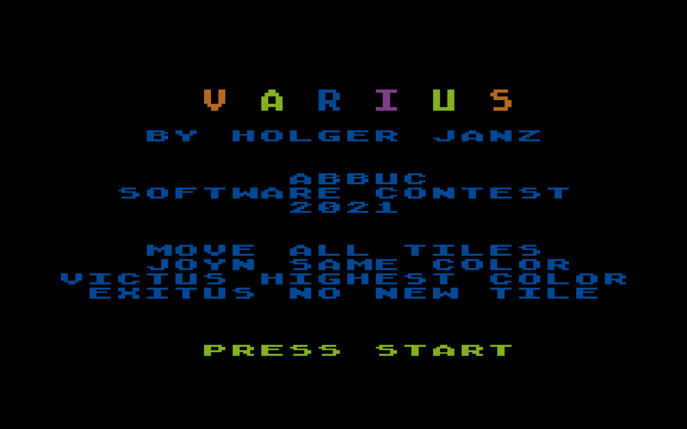
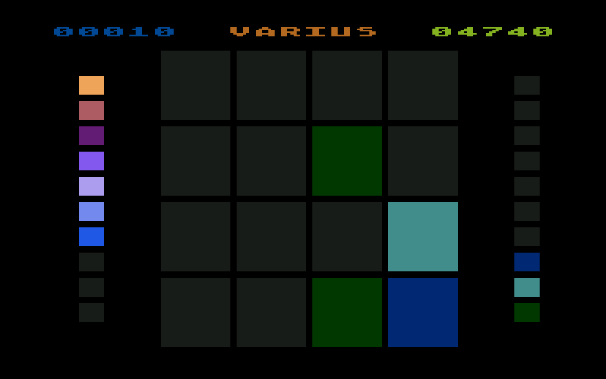
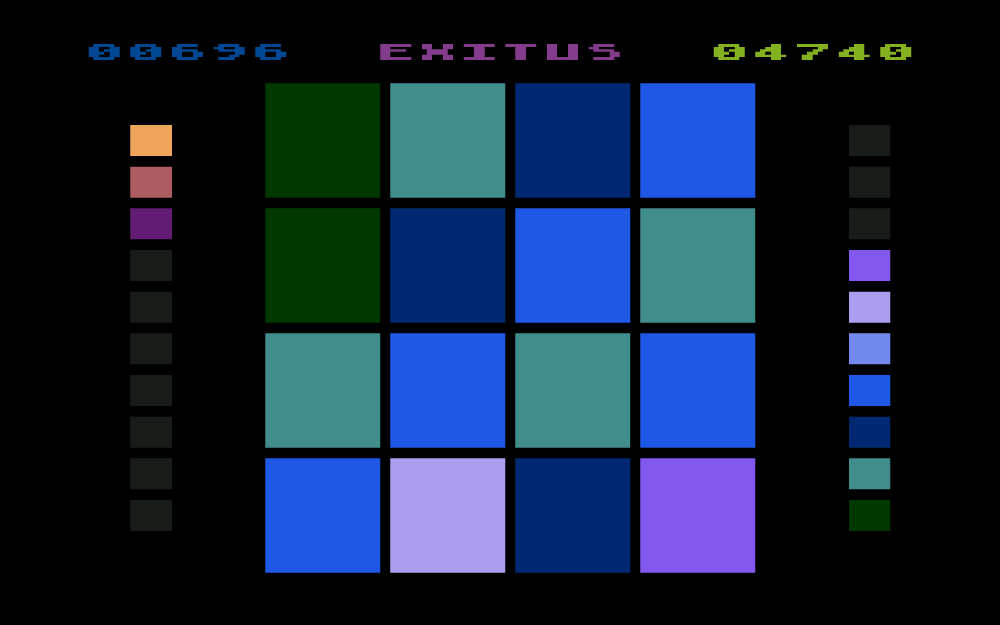
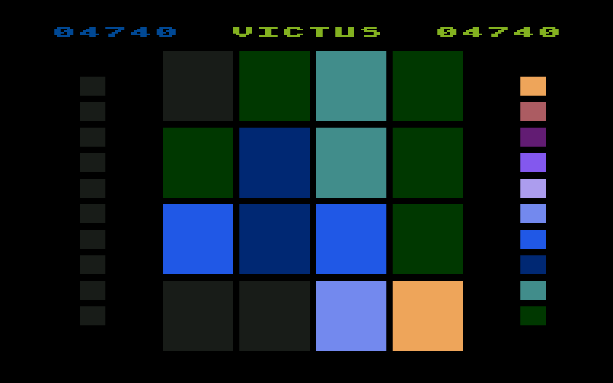

# VARIUS
Atari 8bit/5200 Game VARIUS

by holger janz

abbuc software contest 2021

the objective of the game is to slide color tiles on a grid to combine
them to create tiles with color of higher level. after every slide a new
tile of lowest color appears. the game ends if the highest color is
reached - VICTUS, or no free space for new tile - EXITUS.

scale for colors still to reach is on the left hand side, for colors
already reached on the right hand side. current scores are displayed in
upper left corner, high score in upper right corner.

key START or trigger starts new game and cancels current game. use cursor
keys or joystick to slide tiles.

no random generators are used in this game. same input same result.
challenges:

* what is the highest score for VICTUS?

* what is the highest score for EXITUS?

* are they the same?

* what is the lowest score for VICTUS?

* what is the lowest score for EXITUS?

* are they the same?

the game runs on all Atari 8bit with gita and at least 16k. it uses the memory
from $2480 to $3000. it is an Atari DOS executable and works with all DOS
versions providing MEMLO below $2480. it was developed using an Atari 800XL
(Ultimate 1MB upgrade and Side3 harddisk) with SpartaDOS X and
Fast Assembler 1.8 [https://github.com/HolgerJanz/FastAssembler](https://github.com/HolgerJanz/FastAssembler).
sources are provided with the game.

have fun!

holgerjanz@abbuc.social

  
  
  
  

